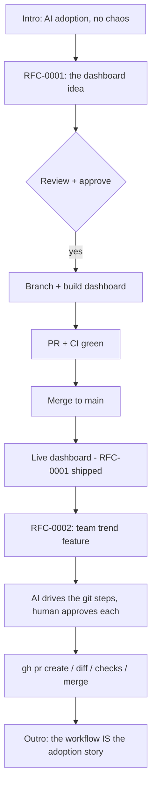

# Demo Guide — AI-Driven Git Workflow

Recorded demo · ~8 minutes · repo: `AbdRaqeeb/ai-git-demo`

## Flowchart

## Pre-flight checklist

- [ ] `npm run dev` works locally (`http://localhost:5173`)
- [ ] `gh pr view 2` shows the open PR
- [ ] `gh pr checks 2` is green (or screenshot it)
- [ ] Terminal: large font, dark theme, prompt visible
- [ ] Repo URL + PR URL copy-pasted into a notes file

## Script (minute-by-minute)

### 0:00–0:30 — Intro
> "I want more AI adoption in our company — but safely. Today I'll show you the
> exact loop I use: a lightweight RFC, then an AI assistant that drives the git
> workflow, with me approving every step. No black boxes."

### 0:30–2:00 — The RFC, then the shipped dashboard
1. Open `docs/rfc-0001-dashboard.md` — read the **Problem** and **Decision**.
   > "One page. Problem, proposal, alternatives, decision. Drafted with AI,
   > decided by a human."
2. `git log --oneline` → show the RFC commit on `main`.
3. `npm run dev` → show the **existing dashboard**. Click around the table.
   > "This shipped per RFC-0001. It works. Now we want to add something new."

### 2:00–3:00 — RFC-0002: propose the new feature
1. Open `docs/rfc-0002-team-trend.md`.
   > "Same template, new idea: drill down per team and see a 4-week trend.
   > Under review — exactly where this belongs before any code exists."
2. Show PR #2 is where it becomes code: `gh pr view 2`.

### 3:00–5:30 — THE core: AI drove the git, you gate the merge
Show the *existing* PR — AI already did the git steps; this is the review gate:

| Step | Command | What you say |
| --- | --- | --- |
| PR | `gh pr view 2` | "The PR body IS the RFC. Review in one place." |
| Diff | `gh pr diff` | "The whole change — small enough to read on screen." |
| Log | `gh pr view 2 --json commits` | "Every commit references the RFC." |
| Checks | `gh pr checks` | "CI builds the Vue app. Green." |
| Approve | `gh pr review 2 --approve` | **Pause.** "This is the control point. AI proposed — *I* approve." |
| Merge | `gh pr merge 2 --squash --delete-branch` | "One click, audit trail kept." |

**Slow down at Approve.** That pause is the whole story.

> Optional: to show the *creation* side live, re-run the branch + PR from the
> cheat-sheet before the call — but the recorded demo only needs the review
> gate and merge.

### 5:30–6:30 — The result
1. `git checkout main && git pull`
2. `npm run dev` → the dashboard now has the **team dropdown + trend chart**.
   > "A feature went from RFC to shipped in minutes — and there's a full paper
   > trail: `gh pr list`, `gh pr view 2 --json commits`.

### 6:30–8:00 — Outro: the adoption pitch
1. **Confidence** — AI can run git because a human gates each step + `gh` audits it.
2. **Speed** — idea to merged feature in minutes, not a sprint.
3. **Reusable** — the RFC template + this repo is a copy-paste template for any team.
> "Copy `docs/`, copy the PR flow. Next month we count: RFCs authored,
> PRs merged, time saved — right here on this dashboard."

## Cheat sheet / recovery

| Problem | Fix |
| --- | --- |
| `gh` command errors | `gh pr view 2` for a safe screen; move on |
| Live app breaks | `npm run preview` serves the last build |
| Branch confusion | `git checkout main && git pull`, re-run `npm run dev` |
| PR #2 already merged | Replay: `git checkout -b feat/team-trend`, commit, `gh pr create --body-file docs/rfc-0002-team-trend.md` |

## Talking points (if Q&A goes long)

- Why RFC first? Decisions get written down before code commits.
- Why `gh` not the web UI? Everything is scriptable + auditable — AI's natural interface.
- Why not let AI merge autonomously? Adoption needs trust first; guardrails scale later.